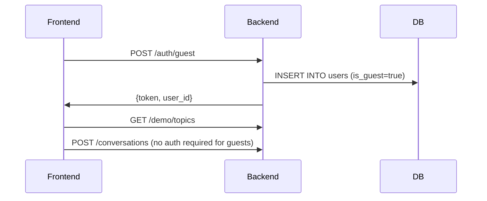

# Outloud Database Schema (Hackathon MVP)

## Design Decisions

1. **Public Demo Access**: Users can try demo topics without signing up
2. **Simple Auth**: Custom JWT auth with `public.users` table 
3. **Pre-seeded Topics**: 4 demo topics with materials loaded at DB setup
4. **3-Turn Limit**: Conversations automatically stop after 3 exchanges
5. **Single Evaluation**: One evaluation per conversation (no historical tracking for MVP)

---

## Tables Overview

| Table | Purpose | Row Count (Demo) |
|-------|---------|------------------|
| `users` | Custom auth (for demo as supabase auth would require deep linking) | ~5 test users |
| `demo_topics` | Pre-loaded study materials | 4 topics |
| `conversations` | User conversations with AI | Dynamic |
| `messages` | User + AI turns | Dynamic |
| `evaluations` | Scores + heatmap | 1 per conversation |

---

## Schema Details

### 1. `users`
Custom authentication table.

| Column | Type | Notes |
|--------|------|-------|
| `id` | uuid | Primary key |
| `username` | text | Unique, required |
| `password_hash` | text | bcrypt hash |
| `is_guest` | boolean | `true` for demo users (no password required) |
| `created_at` | timestamptz | Auto-generated |

**Guest User Flow:**
- Frontend can call `POST /auth/guest` to create a temporary guest user
- Guest users get deleted after 24 hours (cleanup job)
- No password required for guests

---

### 2. `demo_topics`
Pre-seeded study topics (read-only after initial setup).

| Column | Type | Notes |
|--------|------|-------|
| `id` | uuid | Primary key |
| `title` | text | e.g., "Operating Systems - Deadlocks" |
| `description` | text | Short summary |
| `persona` | text | `mentor` or `critic` (which AI persona fits this topic best) |
| `material_text` | text | Full study material for grounding AI responses |
| `created_at` | timestamptz | Auto-generated |

**Initial Topics:**
1. Operating Systems - Deadlocks (Mentor)
2. Photosynthesis Basics (Mentor)
3. IELTS Speaking - Describe Your Hometown (Critic)
4. Startup Pitch - Value Proposition (Critic)

---

### 3. `conversations`
User's conversation sessions.

| Column | Type | Notes |
|--------|------|-------|
| `id` | uuid | Primary key |
| `user_id` | uuid | FK to `users.id`, **nullable for guest users** |
| `topic_id` | uuid | FK to `demo_topics.id` |
| `persona` | text | `mentor` or `critic` (can override topic default) |
| `turn_count` | int | Current turn (0-3), default 0 |
| `status` | text | `active` or `evaluated` |
| `created_at` | timestamptz | Auto-generated |
| `updated_at` | timestamptz | Auto-updated on new messages |

**Business Rules:**
- `turn_count` increments with each user message
- Conversation locks when `turn_count = 3` or `status = 'evaluated'`
- Guests can create conversations without `user_id`

---

### 4. `messages`
User and AI turns in a conversation.

| Column | Type | Notes |
|--------|------|-------|
| `id` | uuid | Primary key |
| `conversation_id` | uuid | FK to `conversations.id` (CASCADE delete) |
| `sender` | text | `user` or `ai` |
| `text` | text | Transcribed/generated text |
| `audio_url` | text | Supabase Storage URL (nullable) |
| `created_at` | timestamptz | Auto-generated |

**Audio Storage:**
- User recordings: `user_audio/{conversation_id}/{message_id}.webm`
- AI TTS responses: `ai_audio/{conversation_id}/{message_id}.mp3`

---

### 5. `evaluations`
Post-conversation analysis (scores + heatmap).

| Column | Type | Notes |
|--------|------|-------|
| `id` | uuid | Primary key |
| `conversation_id` | uuid | FK to `conversations.id` (CASCADE delete) |
| `scores` | jsonb | `{coverage: 85, clarity: 70, correctness: 90, causality: 65}` |
| `heatmap` | jsonb | Array of `{text, verdict, note}` objects |
| `summary` | text | 2-3 sentence overall feedback |
| `retell_prompt` | text | 20-second challenge instruction |
| `created_at` | timestamptz | Auto-generated |

**Heatmap Structure:**
```json
[
  {
    "text": "Deadlocks happen when processes wait for each other",
    "verdict": "strong",
    "note": "Clear explanation of circular wait"
  },
  {
    "text": "and like, stuff gets stuck",
    "verdict": "vague",
    "note": "Too informal, lacks technical precision"
  },
  {
    "text": "You prevent it by killing processes randomly",
    "verdict": "misconception",
    "note": "Random killing is not a prevention strategy - confusing detection with prevention"
  }
]
```

**Verdict Color Mapping:**
- `strong` = 🟩 Green
- `vague` = 🟨 Yellow  
- `misconception` = 🟥 Red

---

## Indexes

| Index | Purpose |
|-------|---------|
| `idx_users_username` | Fast login lookups |
| `idx_conversations_user` | User's conversation history |
| `idx_conversations_topic` | Topic analytics (optional) |
| `idx_messages_conversation` | Fast message retrieval |
| `idx_evaluations_conversation` | One evaluation per conversation |

---

## Storage Buckets (Supabase)

| Bucket | Public? | Purpose |
|--------|---------|---------|
| `user-audio` | No | User voice recordings |
| `ai-audio` | Yes | AI TTS responses (can be cached) |

---

## Demo Data Seed
```sql
-- Example demo topic
INSERT INTO demo_topics (title, description, persona, material_text) VALUES
(
  'Operating Systems - Deadlocks',
  'Understand deadlock conditions and prevention strategies',
  'mentor',
  'A deadlock is a situation where a set of processes are blocked because each process is holding a resource and waiting for another resource acquired by some other process...'
);
```

---

## Guest User Flow


---

## Migration Path (Post-Hackathon)

When adding real features later:

1. **User Profiles**: Add `email`, `avatar_url` to `users`
2. **Custom Topics**: Create `projects` and `materials` tables (from your original schema)
3. **Progress Tracking**: Add `conversation_snapshots` for "fight your past self"
4. **RAG**: Add `material_chunks` with embeddings
5. **Guest Conversion**: Add `PATCH /users/{id}/convert` to upgrade guest → real user